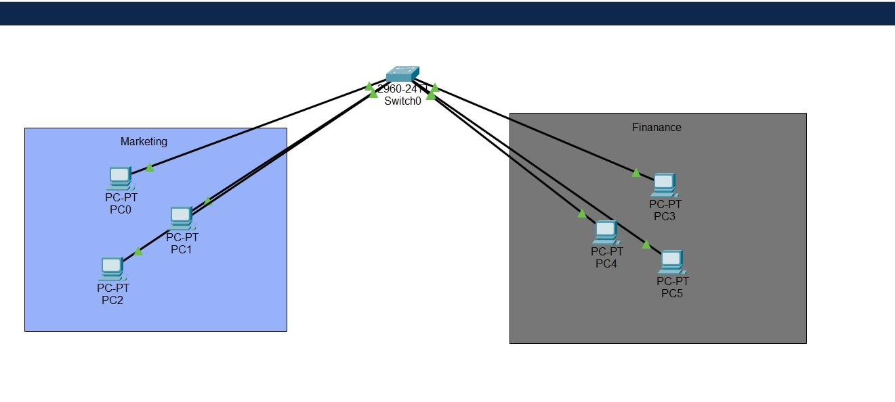
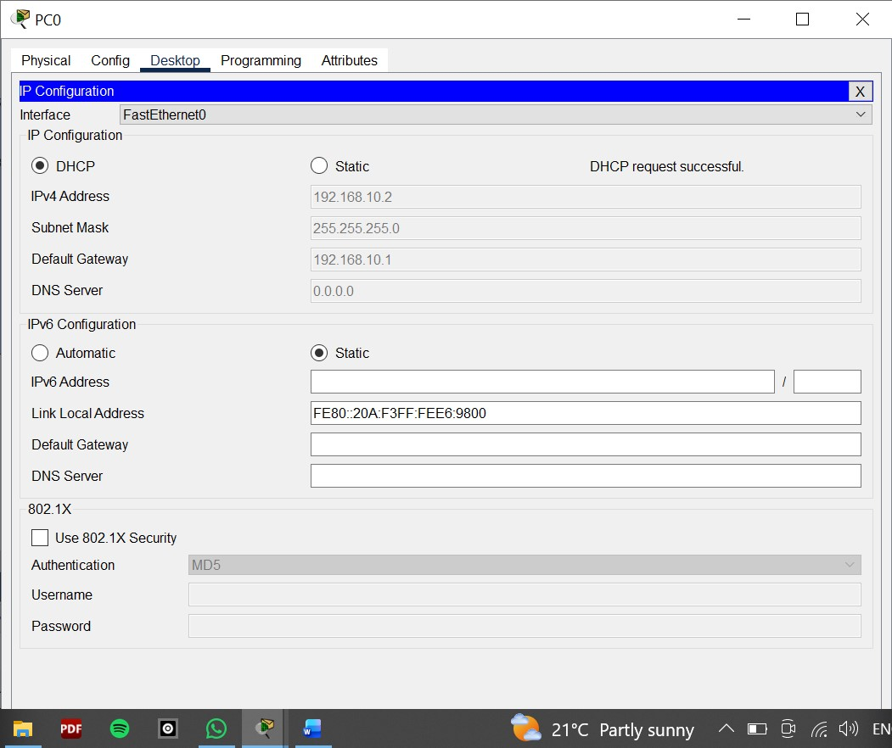
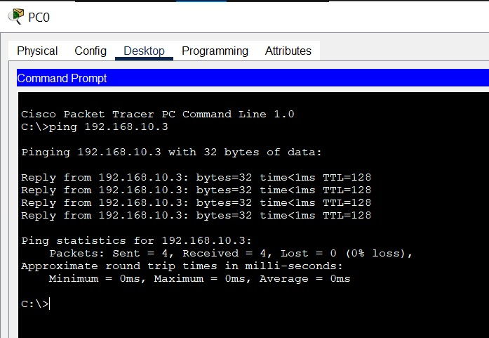

# VLAN Segmentation & DHCP Automation 🏗️

This lab demonstrates logical network segmentation for **Finance** and **Marketing** departments using VLANs on a Cisco 2960 Switch. It includes automated IP addressing via a Layer 3 DHCP server configured directly on the switch.

---

## 📍 Network Topology & Labeling
To replicate this lab, set up your workspace with the following labeling:

### 1. Devices & Connections
* **Switch:** 1x Cisco 2960 (Rename to `Core-Switch`).
* **VLAN 10 (Finance):** * 3 PCs labeled `Fin_PC1`, `Fin_PC2`, and `Fin_PC3`.
    * Connect to ports **Fa0/1**, **Fa0/2**, and **Fa0/3**.
* **VLAN 20 (Marketing):** * 3 PCs labeled `Mkt_PC1`, `Mkt_PC2`, and `Mkt_PC3`.
    * Connect to ports **Fa0/4**, **Fa0/5**, and **Fa0/6**.



---

## 🚀 Implementation & Verification

### 1. VLAN & Port Assignment
The switch is partitioned into two distinct broadcast domains to ensure department isolation.

| Department | VLAN ID | Port Range | IP Subnet | Gateway |
| :--- | :--- | :--- | :--- | :--- |
| Finance | 10 | Fa0/1 - 3 | 192.168.10.0/24 | 192.168.10.1 |
| Marketing | 20 | Fa0/4 - 6 | 192.168.20.0/24 | 192.168.20.1 |

### 2. DHCP Server Configuration
The switch acts as the DHCP server, dynamically providing IP addresses, subnet masks, and default gateways to all connected hosts.

### 3. Verification: DHCP Acknowledgement
Each PC successfully requests and receives an IP address from its respective pool.



### 4. Connectivity Testing
Verification of successful communication within the Finance department (VLAN 10).



---

## 🛠️ Configuration Snippets

### VLAN & Interface Assignment
```bash
# Creating VLANs
Switch(config)# vlan 10
Switch(config-vlan)# name Finance
Switch(config)# vlan 20
Switch(config-vlan)# name Marketing

# Assigning Ports
Switch(config)# interface range fa0/1-3
Switch(config-if-range)# switchport mode access
Switch(config-if-range)# switchport access vlan 10

Switch(config)# interface range fa0/4-6
Switch(config-if-range)# switchport mode access
Switch(config-if-range)# switchport access vlan 20