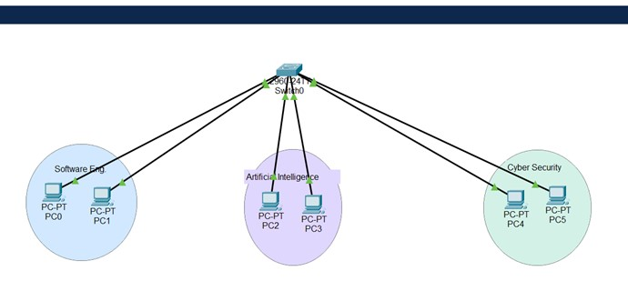
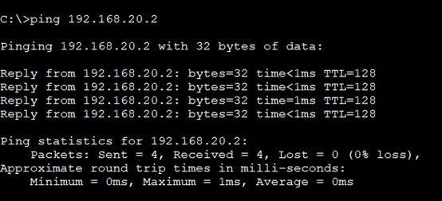
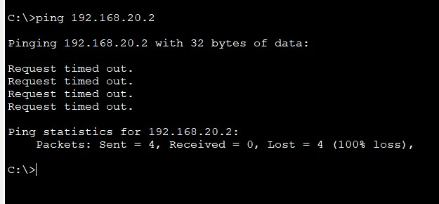

# VLAN Segmentation & Departmental Dissolution 🏗️

This lab demonstrates logical network segmentation for three university departments using VLANs on a Cisco 2960 Switch. It further explores network behavior when a specific VLAN is decommissioned.

## 📍 Network Topology
Below is the logical design of the network, showing the separation of Software Engineering (Blue), Artificial Intelligence (Purple), and Cyber Security (Green).



---

## 🚀 Task 1: Implementation & Verification

### 1. VLAN Configuration
Separate broadcast domains were created to ensure traffic isolation between departments.

| Department | VLAN ID | Port Range | IP Subnet |
| :--- | :--- | :--- | :--- |
| Software Engineering | 10 | Fa0/1 - 2 | 192.168.10.0/24 |
| Artificial Intelligence | 20 | Fa0/3 - 4 | 192.168.20.0/24 |
| Cyber Security | 30 | Fa0/5 - 6 | 192.168.30.0/24 |

### 2. Connectivity Testing (Pre-Deletion)
Verification of successful communication within the AI Department (VLAN 20).



### 3. Department Dissolution
Simulating the removal of the AI department by deleting VLAN 20. This "orphans" the ports, causing them to lose all connectivity despite the physical link remaining active.

### 4. Post-Deletion Impact
The following screenshot confirms that communication fails once the logical VLAN assignment is removed.



---

## 🛠️ Configuration Snippets
```bash
# Deleting the AI Department VLAN
Switch(config)# no vlan 20
Switch(config)# end
Switch# show vlan brief